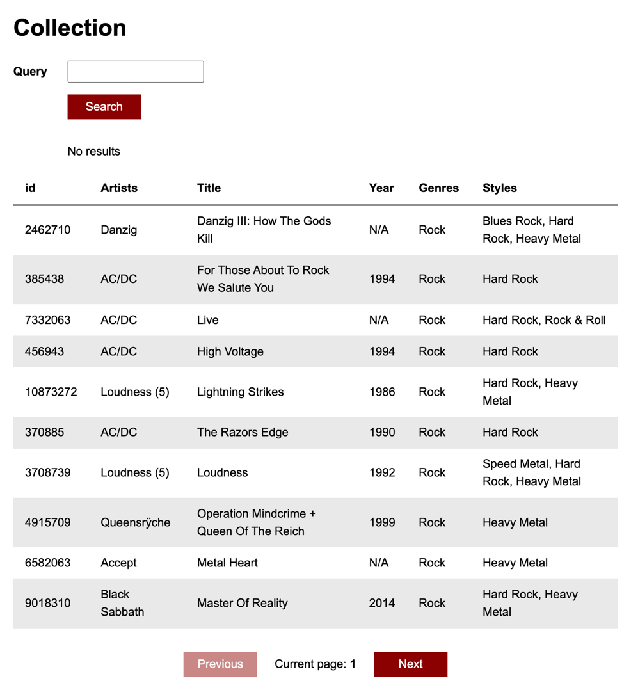

Instalirati NodeJS i NPM
https://nodejs.org/en/

Provjeriti radi li NPM u terminalu (command prompt-u)

```
npm -v
```

Mora vratiti neku verziju, npr "7.18.1".

## 1. Instalacija projekta (samo jednom)

U terminalu otvoriti (navigirati) do datoteke `cd naziv-datoteke` i pokrenuti

```
npm install
```

## 2. Pokretanje projekta

U terminalu otvoriti (navigirati) do datoteke `cd naziv-datoteke` i pokrenuti

```
npm run start
```

# Zadatak

## 1. dan

1. Preuzeti datoteku sa repozitorija (download zip), instalirati i pokrenuti projekt

2. Napraviti sljedeće komponente u `src/components` folderu:

  - SearchForm - za formu (input i button)
  - CollectionTable - za tablicu sa podacima. Tablica mora imati `thead` sa `tr` i `th` zaglavljima i `tbody`. `tr` i `td` markup će se nalaziti u `TableItem` komponenti.
  - TableItem - jedan podatkovni redak tablice (tr u tbody elementu)
  - Pagination - paginacija (previous i next button i trenutni page)

3. Dodati HTML markup za komponente

4. Pozvati komponente u src/App.js

5. U `src/App.js` je importan `data` iz `src/data.json` kojeg danas koristite kao placeholder podatke. Sutra radimo API integraciju.

6. Prosljediti placeholder podatke komponentama putem props-a.

SearchForm - prima standardni React "children" prop koji će sadržavati rezultat pretraživanja. U suprotnom će ispisati "No results".

CollectionTable - prima standardni React "children" prop koji će sadržavati podatkovne retke koji se iterativno pozivaju ovisno o `releases` array-u podataka iz `data.json` datoteke.

TableItem - prima propove za prikaz podataka iz `releases` array-a `data.json` datoteke.

Pagination - prima propove za prikaz podataka iz `pagination` objekta `data.json` datoteke. Potrebni su `pages` koji sadrži ukupan broj pageva i `page` koji sadrži podatak koji je trenutni page.

7. Dodati stilove u `src/index.css` da aplikacija izgleda što bliže screenshotu ili proizvoljno



### Bonus zadaci

1. U `public/index.html` promjeniti <title> vrijednost na vaše ime i prezime i naziv projekta

2. U `public/index.html` dodati <link> element sa CSS linkom na `normalize.css` koji služi za izjednačavanje stilova između browsera. Ukoliko je dobro dodan, font u projektu bi se trebao promjeniti na Arial. https://cdnjs.com/libraries/normalize

### Korisne informacije

Dovršeni zadatak 1. dana: https://react-akademija-app-1.netlify.app/ <br/>
Statičke komponente sa prosljeđenim propovima. Trenutno nema funkcionalnosti.

Tablice
https://www.w3schools.com/html/html_tables.asp

Input
https://www.w3schools.com/tags/tag_input.asp

Button
https://www.w3schools.com/tags/tag_button.asp

Prijedlog strukture `App` komponente sa komponentama

```jsx
  return (
    <div>
      <header>
        {/* Dopuniti sa odgovarajućim HTML markupom i tekstom */>}
      </header>
      <SearchForm>{/* Dopuniti sa propsima */>}</SearchForm>
      <CollectionTable>
        {/* Dopuniti da se iterativno stvaraju TableItem komponente */>}
        <TableItem {/* Dopuniti sa propsima */>} />
      </CollectionTable>

      <Pagination {/* Dopuniti sa propsima */>} />
    </div>
  );
```

Paginacija prima vrijednosti trenutnog pagea i ukupni broj pageva kao prop. Prosljediti hard-codane placeholder propove za sada.

Paginacija ispisuje trenuti page u `Current page:` tekstu između 2 buttona

Ukoliko je trenutni page 1, Postaviti “disabled” atribut na “Previous” button HTML elementa na `true`. U suprotnom na `false`.

Ukoliko je trenutni page jednak ukupnom broju pageva, napraviti isto za `Next` button HTML element

## 2. dan

### Forma za pretraživanje

API URL: `https://api.discogs.com/database/search?q=${query}&key=OxnCHJEetGbikaamOyaK&secret=wQCIuWuanmRVVeWqNVFWMfSJldHbqnAi`

`query` je varijabla teksta forme koji treba predati preko state-a

Na button click poslati query na API i ispisati samo prvi rezultat responsea. Prvi rezultat iz `data` response-a se može dohvatiti ovako:

`Boolean(data.results.length) ? data.results[0].title : "No results"``

Funkciju za submit i state treba napraviti u `App.js`-u. `SearchForm` komponenti predati rezultat pretraživanja preko `children` prop-a. Prosljediti nove propove za: promjenu input statea za query (onChange na input), trenutni query state (value na input) i funkciju za pretraživanje (onClick na button)

### Podatkovna tablica i podatkovni redak

Podatke za tablicu dohvatiti sa API-ja (obrisati import json datoteke iz App.js).
`https://api.discogs.com/users/adrianmusiccollector/collection/folders/0/releases?page=${currentPage}`
   
`currentPage` - varijabla čija je početna vrijednost 1 i ona se može promjeniti preko paginacije

### Korisne informacije

https://developer.mozilla.org/en-US/docs/Web/API/Fetch_API/Using_Fetch
https://reactjs.org/docs/hooks-state.html
https://reactjs.org/docs/hooks-effect.html

Dovršeni zadatak 2. dana: https://react-akademija-app-2.netlify.app/ <br/>
Search vraća rezultat, podaci tablice se promjene klikom na next i previous button elemente

API vraća dva objekta:
`pagination` - podatke za paginaciju (ukupan broj pageva, trenutni page, itd.)
`collection` - array podataka za tablicu za trenutni page.

Paginacijom postavljati state koji je trenutni page odabran i dohvaćati nove rezultate tablice
Ukoliko na API šaljete puno requestova, pričekajte minutu da prođe ograničenje ili mi se javite.

Pripazite da imate dependency array u `useEffect`-u koji treba biti `[]` dok ne implementirate paginaciju, a onda treba ovisiti o odabranom pageu koji je sačuvan u state-u.

Možete imati i do 4 useState poziva, ovisno kako strukturirate state. Preporučujem za početak da imate odvojeni state dok se ne uvježbate.

- searchQuery - tekst koji se pretražuje
- searchResult - rezultat pretraživanja
- currentPage - odabrani page iz paginacije (početno stanje je 1)
- data - paginacija i collection array podataka

Koristite samo 1 useEffect sa dependency arrayom. Dohvaćanje podatka kolekcije (paginacija + collection) kada se aplikacija mounta i kada se currentPage promjeni.

Imate definiran search button handler funkciju - poziva API za pretraživanje.

Prijedlog `useEffect` i submit funkcije u `App.js`-u

```jsx
/* Dohvaćanje kolekcije */
useEffect(() => {
  fetch()
    /* Dohvaćanje API URL-a sa prosljeđenom paginacijom */
    .then((data) => data.json())
    .then((data) => {
      /* Dopuniti sa state update funkcijom */
    });
}, [currentPage]);

const handleSearch = () => {
  fetch(
    `https://api.discogs.com/database/search?q=${query}&key=OxnCHJEetGbikaamOyaK&secret=wQCIuWuanmRVVeWqNVFWMfSJldHbqnAi`
  )
    .then((data) => data.json())
    .then((data) => {
      setQueryResult(
        Boolean(data.results.length) ? data.results[0].title : "No results"
      );
    });
};
```
